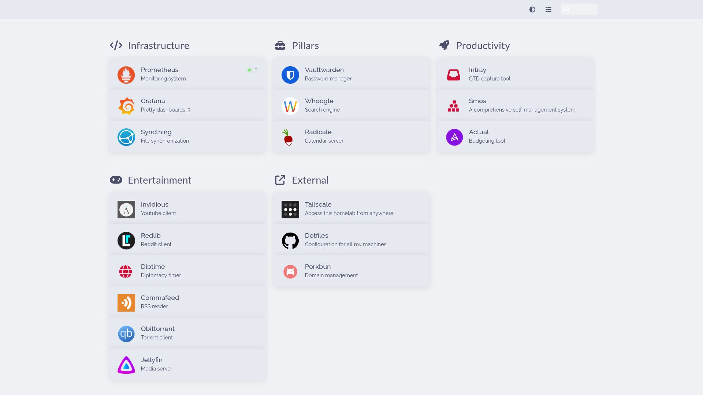

# Welcome to _the Satellite_

In case you are not familiar with nix/nixos, this is a collection of configuration files which build all my systems in a declarative manner. The tool used to configure the global system is called [nixos](https://nixos.org/), and the one used to configure the individual users is called [home-manager](https://github.com/nix-community/home-manager).

> A [visual history](./docs/history.md) of my setup is in the works!

## Features this repository includes:

- Sets up all the apps I use — including git, neovim, fish, tmux, starship, hyprland, anyrun, discord, zathura, foot & much more.
- Sets up my entire homelab — including zfs-based [impermanence](https://grahamc.com/blog/erase-your-darlings), automatic let's-encrypt certificates, tailscale, syncthing, vaultwarden, whoogle, pounce, calico, smos, intray, actual & more.
- Consistent base16 theming using [stylix](https://github.com/danth/stylix)
- Declarative secret management using [sops-nix](https://github.com/Mic92/sops-nix)

The current state of this repo is a refactor of my old, messy nixos config, based on the structure of [this template](https://github.com/Misterio77/nix-starter-configs).

## Hosts

This repo's structure is based on the concept of hosts - individual machines configured by me. I'm naming each host based on things in space/mythology (_they are the same picture_). The hosts I have right now are:

- [tethys](./hosts/nixos/tethys/) — my personal laptop
- [lapetus](./hosts/nixos/lapetus/) — older laptop running as a server
- [euporie](./hosts/nixos/euporie/) — barebones host for testing things insdie a VM
- enceladus — my android phone. Although not configured using nix, this name gets referenced in some places

## File structure

| Location                     | Description                                         |
| ---------------------------- | --------------------------------------------------- |
| [common](./common)           | Configuration loaded on both nixos and home-manager |
| [devshells](./devshells)     | Nix shells                                          |
| [docs](./docs)               | Additional documentation regarding my setup         |
| [home](./home)               | Home manager configurations                         |
| [hosts/nixos](./hosts/nixos) | Nixos configurations                                |
| [modules](./modules)         | Custom generic/nixos/home-manager modules           |
| [overlays](./overlays)       | Nix overlays                                        |
| [pkgs](./pkgs)               | Nix packages                                        |
| [flake.nix](./flake.nix)     | Nix flake entrypoint!                               |
| [scripts](./scripts)         | Bash scripts that come in handy when on a live cd   |
| [.sops.yaml](./.sops.yaml)   | Sops entrypoint                                     |
| [stylua.toml](./stylua.toml) | Lua formatter config for the repo                   |

## Points of interest

Here's some things you might want to check out:

- My [neovim config](./home/features/neovim/default.nix)
  - written using a [custom neovim config generation framework](./modules/common/korora-neovim.nix)
  - [snippets](./home/features/neovim/snippets) written in [miros](https://github.com/prescientmoon/miros) — my custom snippet generation language
- The [flake](./flake.nix) entrypoint for this repository

## Things I use

> This does not include links to every plugin I use for every program here. You can see more details in the respective configurations.

### Fundamentals

- [Nixos](http://nixos.org/) — nix based operating system
- [Home-manager](https://github.com/nix-community/home-manager) — manage user configuration using nix
- [Impernanence](https://github.com/nix-community/impermanence) — see the article about [erasing your darlings](https://grahamc.com/blog/erase-your-darlings)
- [Sops-nix](https://github.com/Mic92/sops-nix) — secret management
- [disko](https://github.com/nix-community/disko) — format disks using nix
  - [zfs](https://openzfs.org/wiki/Main_Page) — filesystem

### Input handling

- [kanata](https://github.com/jtroo/kanata) — software-level keyboard layout customizer. One of the few such programs with support for chording
- [opentabletdriver](https://opentabletdriver.net/)

### Graphical

- [Stylix](https://github.com/danth/stylix) — base16 module for nix
  - [Base16 templates](https://github.com/chriskempson/base16-templates-source) — list of base16 theme templates
  - [Catpuccin](https://github.com/catppuccin/catppuccin) — base16 theme I use
  - [Rosepine](https://rosepinetheme.com/) — another theme I use
- [Hyprland](https://hyprland.org/) — wayland compositor
  - [Wlogout](https://github.com/ArtsyMacaw/wlogout) — wayland logout menu
  - [Hyprpicker](https://github.com/hyprwm/hyprpicker) — hyprland color picker
  - [Grimblast](https://github.com/hyprwm/contrib/tree/main/grimblast) — screenshot tool
  - [Dunst](https://dunst-project.org/) — notification daemon
  - [Wlsunset](https://sr.ht/~kennylevinsen/wlsunset/) — day/night screen gamma adjustments
  - [Anyrun](https://github.com/Kirottu/anyrun) — program launcher
- [Foot](https://codeberg.org/dnkl/foot) — terminal emulator
- [Zathura](https://pwmt.org/projects/zathura/) — pdf viewer
- [Firefox](https://www.mozilla.org/en-US/firefox/) — web browser
- [Tesseract](https://github.com/tesseract-ocr/tesseract) — OCR engine
- [Obsidian](https://obsidian.md/) — note taking software
- [Bitwarden](https://bitwarden.com/) — client for self-hosted password manager

### Terminal

> There are many clis I use which I did not include here, for the sake of brevity.

- [Neovim](https://neovim.io/) — my editor
  - [Neovide](https://neovide.dev/index.html) — neovim gui client
  - [Vimclip](https://github.com/hrantzsch/vimclip) — vim anywhere!
- [Tmux](https://github.com/tmux/tmux/wiki) — terminal multiplexer
- [Fish](https://fishshell.com/) — user friendly shell
  - [Starship](https://starship.rs/) — shell prompt
- [yazi](https://github.com/sxyazi/yazi) — file manager
- [Catgirl](https://git.causal.agency/catgirl/about/) — irc client
- [lazygit](https://github.com/jesseduffield/lazygit) — git tui
- Self management:
  - [Smos](https://github.com/NorfairKing/smos) — selfhosted comprehensive self-management system
  - [Intray](https://github.com/NorfairKing/intray) — selfhosted GTD capture tool

### Services

Most services are served over [tailscale](https://tailscale.com/), using certificates generated by [let's encrypt](https://letsencrypt.org/).

- [Actual](https://actualbudget.org/) — budgeting tool.
- [Commafeed](https://github.com/Athou/commafeed) — rss reader
- [Forgejo](https://forgejo.org/) — git forge
- [Grafana](https://github.com/grafana/grafana) — pretty dashboards
- [Guacamole](https://guacamole.apache.org/) — remote desktop access
- [Homer](https://github.com/bastienwirtz/homer) — server homepage
- [Intray](https://github.com/NorfairKing/intray) — GTD capture tool.
- [Invidious](https://invidious.io/) — alternate youtube client
- [Jellyfin](https://jellyfin.org/) — media server
- [Jupyterhub](https://jupyter.org/hub) — notebook collaboration suite
- [Microbin](https://microbin.eu/) - code & file sharing service
- [Pounce](https://git.causal.agency/pounce/about/) & [calico](https://git.causal.agency/pounce/about/calico.1) — irc bouncer
- [Prometheus](https://github.com/prometheus/prometheus) — metric collector
- [Qbittorrent](https://www.qbittorrent.org) — torrent client
- [Radicale](https://radicale.org/v3.html) — calendar server
- [Redlib](https://github.com/redlib-org/redlib) — alternate reddit client
- [Smos](https://github.com/NorfairKing/smos) — a comprehensive self-management system.
- [Syncthing](https://syncthing.net/) — file synchronization
- [Vaultwarden](https://github.com/dani-garcia/vaultwarden/) — password manager
- [Whoogle](https://github.com/benbusby/whoogle-search#manual-docker) — search engine

## Hall of fame

Includes links to stuff which used to be in the previous section but is not used anymore. Only created this section in June 2023, so stuff I used earlier might not be here. Sorted with the most recently dropped things at the top.

- [Wezterm](https://github.com/wez/wezterm) — I switched to [Foot](https://codeberg.org/dnkl/foot), as wezterm was laggy, unstable, and kept breaking between releases
- [Ranger](https://github.com/ranger/ranger) — I switched to [Yazi](https://github.com/sxyazi/yazi)
- [firenvim](https://glacambre/firenvim) - the concept is cool, but I found the whole thing pretty annoying at times
- [venn.nvim](https://jbyuki/venn.nvim) — the concept is cool, but I would use it about once a year
- [hydra.nvim](https://anuvyklack/hydra.nvim) — I was rarely using it, and it was taking up precious config space
- [winbar.nvim](https://github.com/fgheng/winbar.nvim) — I mostly had this here for the looks, so I moved the path it provided to my statusbar
- [treesitter-visual-context.nvim](https://github.com/haringsrob/nvim_context_vt) — felt like this was cluttering my screen more than anything
- [Paperplanes.nvim](https://rktjmp/paperplanes.nvim) — replaced by a single curl call
- [Eww](https://github.com/elkowar/eww) - experimented with eww for a bit, but setup was painful and bars are a bit useless
- [Neogit](https://github.com/NeogitOrg/neogit) — was a bit slow / clunky, so I switched to [lazygit](https://github.com/jesseduffield/lazygit)
- [Slambda](https://github.com/prescientmoon/slambda) — custom keyboard chording utility. I retired the project in favour of [kanata](https://github.com/jtroo/kanata)
- [GPG](https://gnupg.org/) + [pass](https://www.passwordstore.org/) — I switched to [vaultwarden](https://github.com/dani-garcia/vaultwarden/)
- [Agenix](https://github.com/ryantm/agenix) & [homeage](https://github.com/jordanisaacs/homeage) — I switched to [sops-nix](https://github.com/Mic92/sops-nix)
- [Mind.nvim](https://github.com/phaazon/mind.nvim) — self management tree editor. The project got archived, so I switched to [Smos](https://github.com/NorfairKing/smos).
- [Null-ls](https://github.com/jose-elias-alvarez/null-ls.nvim) — general purpose neovim LSP. The project got archived, so I switched to [formatter.nvim](https://github.com/mhartington/formatter.nvim).
- [Wofi](https://sr.ht/~scoopta/wofi/) — program launcher. I switched to [Anyrun](https://github.com/Kirottu/anyrun).
- [Alacritty](https://github.com/alacritty/alacritty) — terminal emulator. I switched to [Wezterm](https://wezfurlong.org/wezterm/).
- [Xmonad](https://xmonad.org/) — xorg window manager. I switched to [Hyprland](https://hyprland.org/).
  - [Polybar](https://github.com/polybar/polybar) — desktop bar
  - [Rofi](https://github.com/davatorium/rofi) — program launcher. I switched to [Wofi](https://sr.ht/~scoopta/wofi/).
  - [Spectacle](https://apps.kde.org/spectacle/) — screenshot tool. I switched to [Grimblast](https://github.com/hyprwm/contrib/tree/main/grimblast).
- [Chrome](https://www.google.com/chrome/) — web browser. I switched to `firefox` because it offers a better HM module.
