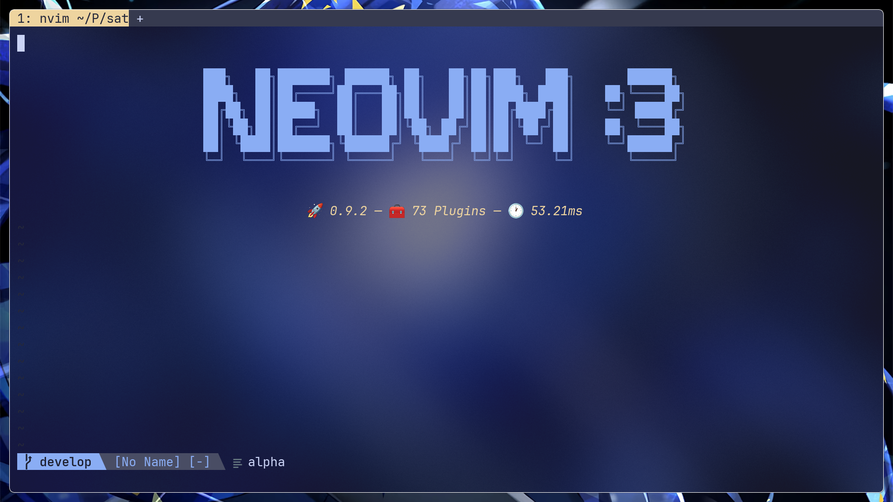
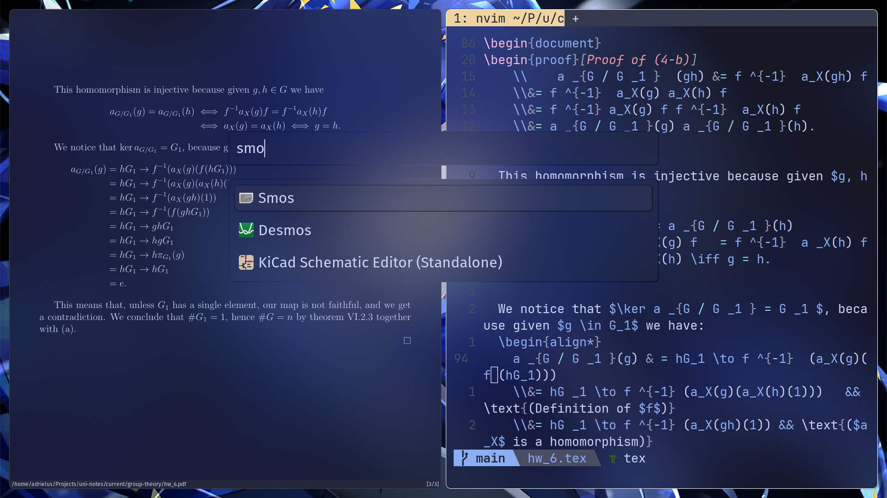

# The history of the satellite

This file tells the story of my setup throughout it's history. This document is not yet complete, and much more will get added as I dig old pictures up. Sadly, a lot of my early days on linux were lost to time (not having a good reasons to simply take pictures of my desktop back in the KDE days and all)

## 2023-11-08

